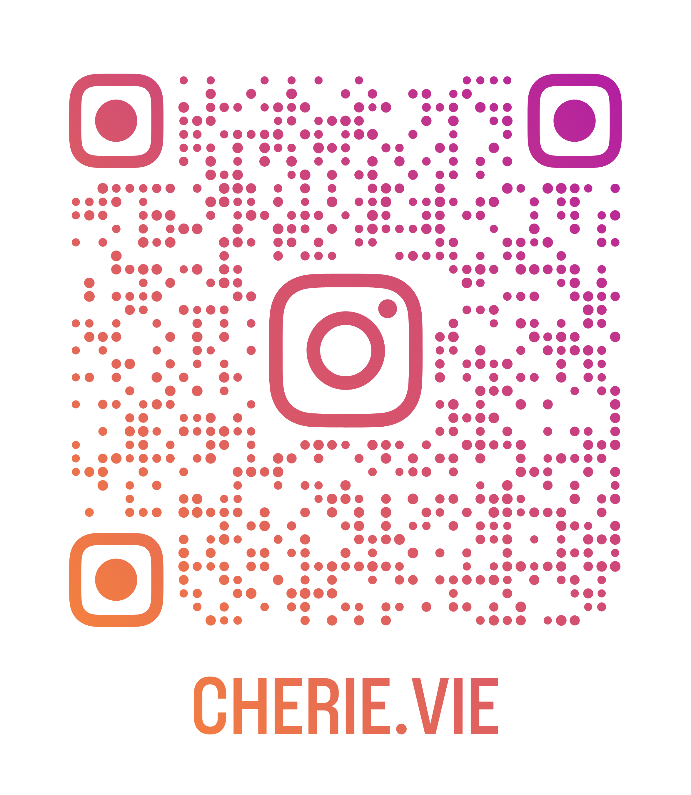

<!DOCTYPE html>
<html lang="id">
<head>
    <meta charset="UTF-8">
    <meta name="viewport" content="width=device-width, initial-scale=1.0">
    <title>Website Pengantar Cookies Lucu</title>
    <!-- Link Google Fonts untuk font elegan -->
    <link href="https://fonts.googleapis.com/css2?family=Playfair+Display:wght@400;700&display=swap" rel="stylesheet">
    
</head>
<body>
    <header>
        <h1>🍪 Selamat Datang di Fun with Cherie.vie! 🍪</h1>
    </header>

    <section class="hero">
        <h2>Hai, Dearist Cherie!</h2>
        
Nikmati setiap gigitan dari cookies premium yang terbuat dengan bahan-bahan terbaik. Dapatkan kombinasi sempurna antara tekstur luar yang crispy dan kelembutan di dalamnya

        

        <button onclick="alert('Yay! Kamu klik cookie! Sekarang makan satu, tapi jangan habis semua ya! 😄')">Mulai Petualangan</button>
    </section>

    <section class="facts">
        <h2>Fakta Lucu tentang Cookies</h2>
        

            <h3>🍪 Cookie Bisa Terbang?</h3>
            
Tidak, tapi kalau kamu makan terlalu banyak, kamu bisa 'terbang' ke dunia mimpi! Zzz...

        

        

            <h3>🍪 Hari Cookies?</h3>
            
Ternyata ada hari Cookies dunia loh! pada tanggal 4 Oktober!

        

        

            <h3>🍪 Superpower Cookie</h3>
            
Mereka bisa membuat hari burukmu jadi manis! Coba deh, makan satu sekarang!

        

        

            <h3>🍪 Cookie vs. Kue</h3>
            
Cookie lebih kecil, tapi lebih lucu! Mereka seperti kue yang pakai topi party.

        

    </section>

    <!-- Bagian Mini Game Baru -->
    <section class="game">
        <h2>🍪 Mini Game: Cookie Catcher! 🍪</h2>
        
Klik cookies yang muncul untuk mengumpulkan poin. Jangan biarkan mereka lolos! Skor tertinggi menang!

        
Skor: 0

        

    </section>

      <footer>
        
Terima kasih sudah mampir! Dijamin, sekali makan cookies kami, kamu bakal langsung ngomong: "Kenapa aku nggak coba dari dulu?" 🍪❤️

        
        <!-- Bagian Kode QR Instagram -->
        

            <h3>🍪 Ikuti Kami di Instagram! 🍪</h3>
            
Scan kode QR di bawah untuk Instagram dan update terbaru. Jangan lupa follow ya!

             <!-- Ganti dengan URL gambar QR asli -->
        

    </footer>

    
</body>
</html>
